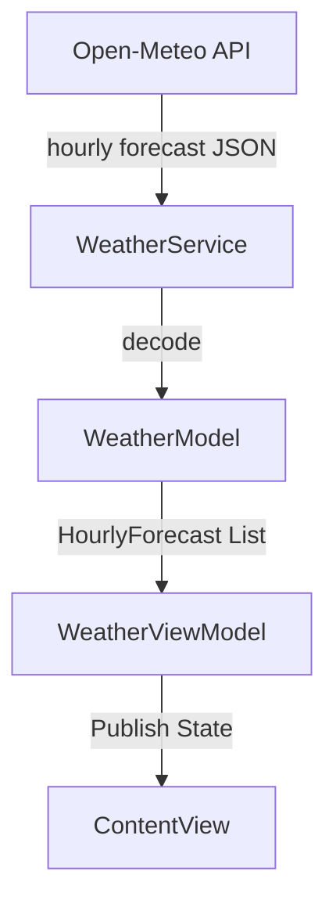

# Design Spec: Hourly Weather Forecast Bar & 7-Day Forecast Removal

This document outlines the design and architecture for adding an hourly weather forecast bar and removing the 7-day forecast view in the Climyte application.

## 1. Goal & Context
The user wants to replace the 7-day weather forecast with an interactive, horizontal hourly weather bar that shows current and next-day hour-by-hour temperatures and condition icons (with a visual "Today" vs "Tomorrow" transition, similar to the reference image provided). The hourly bar will be styled as a glassmorphic footer inside the main current weather card.

## 2. Requirements & UI Layout
* **Remove 7-Day Forecast**: Completely strip the 7-day forecast view and its corresponding functions.
* **Hourly Weather Bar Placement**: Positioned at the bottom (as a footer) inside the main `mainWeatherCard` view.
* **Hourly Bar Styling**:
  * Horizontal scrolling list of hourly items.
  * Displays: Time (e.g., "11 pm", "12 am"), Weather SF Symbol, Temperature (e.g., "9°").
  * **Today/Tomorrow Dividers**:
    * Headers at the top of the timeline ("Today" and "Tomorrow") scrolling or anchored.
    * A vertical line dividing "Today's" hours from "Tomorrow's" hours.
* **Data Limits**: Fetch and display the next 24 hours of forecast data starting from the current hour.

---

## 3. Technical Architecture



### Data Layer (`WeatherModel.swift`)
* Add `HourlyForecast` struct:
  ```swift
  struct HourlyForecast: Identifiable {
      let id = UUID()
      let time: String // e.g. "11 pm"
      let isTomorrow: Bool
      let condition: WeatherCondition
      let temperature: Double
  }
  ```
* Update `WeatherResponse` to decode:
  * `hourly: HourlyWeatherResponse`
* Update `HourlyWeatherResponse`:
  ```swift
  struct HourlyWeatherResponse: Decodable {
      let time: [String]
      let temperature_2m: [Double]
      let weather_code: [Int]
  }
  ```
* Update `CityWeather` to hold an array of `HourlyForecast`.
* In `CityWeather.init`, parse Open-Meteo's hourly arrays:
  * Match only the next 24 hours starting from the current time.
  * Determine if the hour belongs to "Today" or "Tomorrow" to mark `isTomorrow` and format the hour text in lowercase `"h a"` (e.g. `"11 pm"`).

### Network Layer (`WeatherService.swift`)
* Update the endpoint URL to query `hourly=temperature_2m,weather_code`.

### View Layer (`ContentView.swift`)
* Remove `forecastSection` call and definition.
* Build `hourlyForecastSection(_ weather: CityWeather)` view.
* Inside `mainWeatherCard`, append a divider and the `hourlyForecastSection` at the bottom of the VStack.
